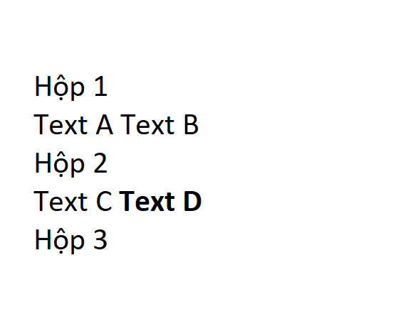
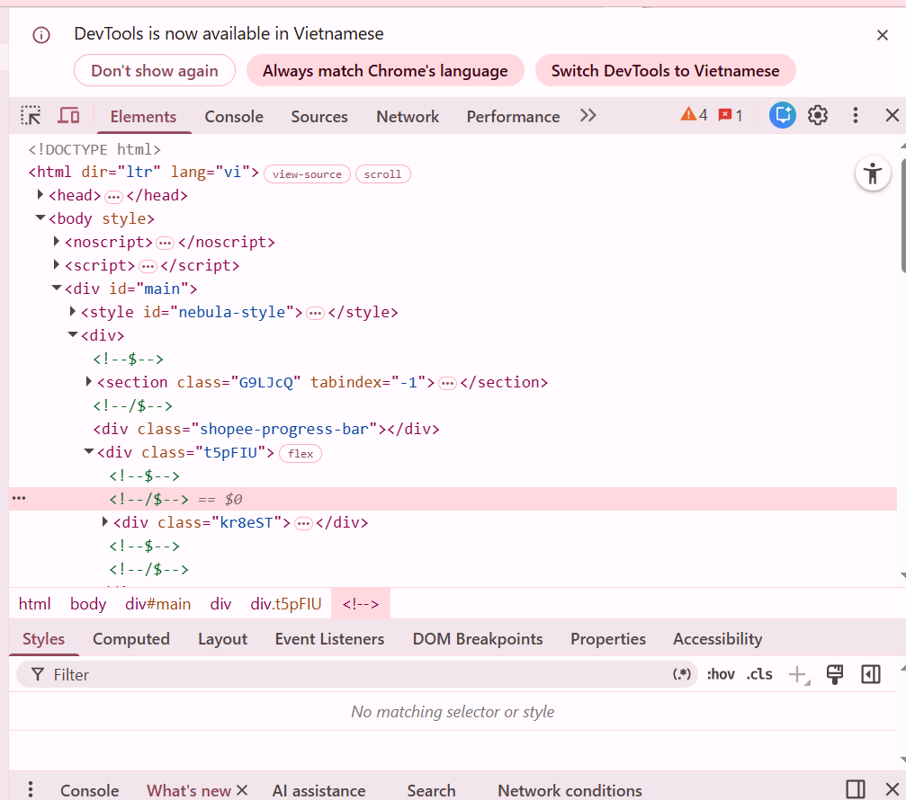
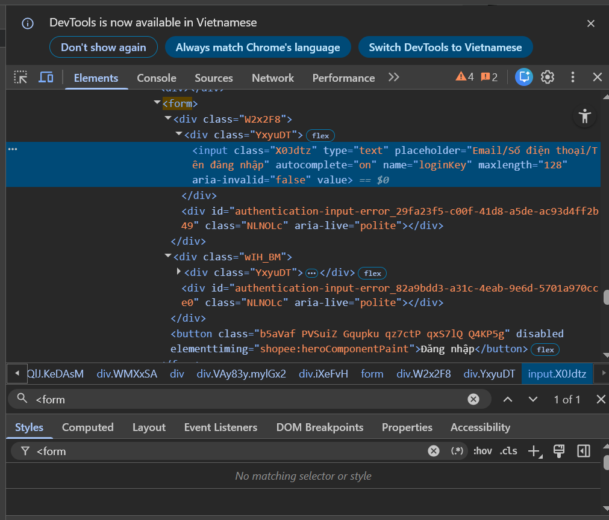

Câu A1: Nguồn tham chiếu: chương 01(01_introduction_html_universe.md) 
1. Trong phần "Cuộc Hành Trình 0.3 Giây Xuyên Đại Dương"
Các bước xảy ra (từ DNS lookup đến render).
- Request của tôi xuất phát từ laptop → đi qua router WiFi của nhà mình
- Qua nhà mạng mà tôi đang sử dụng → Hệ thống định vị tìm địa chỉ IP của Shopee để gói tin biết đích đến.
- Gói tin chạy xuyên cáp quang tới Data Center của Shopee.
- Server xử lý: nhận lệnh " tôi muốn xem trang chủ"
-> Server truy vấn Database để lấy danh sách sản phẩm
- Response chạy ngược lại: cáp quang → nhà mạng → router → laptop
- Chrome nhận file HTML, CSS, JS → render ra giao diện 

2. Nguồn tham khảo: Trang facebook.com
Tab Network trong DevTools giống cho thấy những thông tin:
- Danh sách tài nguyên: Mọi file HTML, CSS, JS, hình ảnh, video, và các lời gọi API.
- Name: tên file ( nhưng được mã hoá để tránh lặp )
- Status: Request thành công (200) hay thất bại (404, 500).
- Type: Phân loại xem đó là script, stylesheet, hay ảnh.
- Size: Dung lượng file tải về (giúp tối ưu tốc độ trang).
- Time: Cho thấy file nào tải trước, file nào tải sau và mất bao lâu.

_____________________________________________________________
Câu A2: Nguồn tham khảo: (CHƯƠNG 04 Visible Part of HTML)
Trong phần: Semantic HTML5 — "Thẻ có ý nghĩa"

- Web ban đầu:

    
ShopTLU

    

        
<a href="/">Trang chủ</a>

        
<a href="/products">Sản phẩm</a>

    

    

        
iPhone 16 Pro

        
25.990.000đ

        

    

© 2026 ShopTLU

-- Một trang web như trên bị Google đánh giá SEO thấp vì:
    Việc lạm dụng thẻ 
 cho mọi thành phần ("Div-soup") khiến cấu trúc trang web trở nên vô nghĩa trong mắt các công cụ tìm kiếm và các thiết bị hỗ trợ người khuyết tật.

-- 4 lỗi semantic:
    1. Sử dụng div cho header, main, footer
    2. Menu được bọc trong div và các đường link nằm trong div con. 
    3. Dùng div cho một thực thể độc lập (iPhone 16 Pro).
    4. Dùng div cho tiêu đề và thiếu alt

-- Sửa lại trang web:
<header>
    
ShopTLU

    <nav class="menu">
        <ul>
            <li><a href="/">Trang chủ</a></li>
            <li><a href="/products">Sản phẩm</a></li>
        </ul>
    </nav>
</header>
<main>
    <article class="product">
        <h1 class="title">iPhone 16 Pro</h1>
        
25.990.000đ

        <figure class="image">
            
        </figure>
    </article>
</main>
<footer>© 2026 ShopTLU</footer>

_____________________________________________________________
Câu A3:

-- Giải thích:
+ Thẻ 
 luôn xếp trên dòng mới và chiếm toàn bộ chiều rộng. Hộp 1, 2, 3 đều dùng 
 nên mỗi cái hộp nằm trên một dòng riêng.
+ Thẻ  lấy vừa đủ chiều rộng của nội dung bên trong nên không làm xuống dòng, chúng xếp hàng ngang với nhau
+ Thẻ <strong> cũng không làm xuống dòng mà xếp ngang với nhau, đặc biệt nó còn làm cho in đậm - nhấn mạnh ( điều này là do các trình duyệt mặc định gán cho thẻ <strong> thuộc tính trong css).

_____________________________________________________________
Câu A4: Nguồn tham khảo: Chương 5- TABLES & HYPERLINKS
- Sự khác nhau giữa <thead>, <tbody>, <tfoot>:
+ <thead>: Header - Tiêu đề cột
+ <tbody>: Body	- Dữ liệu chính
+ <tfoot>: Footer - Tổng kết

- KHÔNG NÊN dùng table để tạo layout trang web vì:
+ <table> chỉ dùng cho dữ liệu dạng bảng (danh sách, so sánh, thống kê). KHÔNG dùng cho layout trang web.
+ Tốc độ tải trang chậm.
+ Bảng có tính chất rất cứng nhắc. Khi  xem trang web trên điện thoại, một layout dùng <table> sẽ bị tràn màn hình hoặc co cụm lại rất xấu.
+ Trình đọc màn hình sẽ đọc bảng theo thứ tự từng ô (cell), khiến người khiếm thị không thể hiểu được bố cục trang web.

_______________________________________________________________
Câu B3:
- Lỗi 1: Dòng 1 — Khai báo <!DOCTYPE> thiếu html — Sửa thành <!DOCTYPE html>.
- Lỗi 2: Dòng 1 — Thẻ <html> thiếu thuộc tính ngôn ngữ lang — Thêm lang="vi" để hỗ trợ trình duyệt và SEO.
- Lỗi 3: Dòng 2 — Thẻ <title> thiếu thẻ đóng </title> — Thêm </title> sau tiêu đề trang.
- Lỗi 4: Dòng 3 — Giá trị charset utf8 sai định dạng — Sửa thành "UTF-8" (có dấu gạch ngang).
- Lỗi 5: Dòng 4 — Thẻ <h1> đóng sai bằng thẻ mở <h1> — Sửa thành </h1>.
- Lỗi 6: Dòng 8 — Thẻ liên kết <a> đầu tiên đóng sai bằng <a> — Sửa thành </a>.
- Lỗi 7: Dòng 15 — Thẻ  thiếu thuộc tính bắt buộc alt và giá trị src thiếu dấu ngoặc kép — Bao giá trị src trong dấu "" và thêm mô tả alt.
- Lỗi 8: Dòng 17 — Các thẻ <b> và 
 bị đóng chồng chéo (overlapping tags) — Đóng thẻ theo thứ tự ngược lại: </b>
.
- Lỗi 9: Dòng 23 — Thẻ <table> thiếu cấu trúc Semantic (<thead>, <tbody>) — Bổ sung các thẻ này để phân cấp dữ liệu bảng.
- Lỗi 10: Dòng 25, 26 — Dòng tiêu đề của bảng đang dùng thẻ <td> — Sửa thành <th> để định nghĩa đúng đây là các ô tiêu đề cột.
- Lỗi 11: Dòng 36 — Sử dụng thẻ <main> lần thứ hai — Một trang web chỉ được có duy nhất một thẻ <main>. Thay thế thẻ thứ hai bằng <aside> (vì đây là nội dung bên lề).
- Lỗi 12: Dòng 41 — Thẻ 
 trong footer thiếu thẻ đóng — Thêm 
 để kết thúc đoạn văn bản.

______________________________________________________________
Câu B4: Phân tích trang shopee.vn
1. 
- 3 thẻ semantic HTML5 mà trang shopee sử dụng: 
+ <section>: Trong code (<section class="G9LjCQ" ...>). Thẻ này dùng để chia các phân đoạn nội dung logic trên trang đăng nhập.
+ <html>: Có thuộc tính lang="vi", khai báo ngôn ngữ chính xác cho trình duyệt.
+ <noscript>: (Dưới thẻ <body>) Thẻ này dùng để hiển thị nội dung thay thế nếu người dùng tắt JavaScript — một thẻ semantic quan trọng cho tính tiếp cận.

2. Không tìm được thẻ <table> trong trang shoppe
- Đã tìm các mặt hàng có thông số ( thường họ để bảng ) nhưng bảng đó em thấy toàn là ảnh.

3. 
- Form đó có  method GET. Không có action
- Các Input types được dùng:
+ type="text": ô nhập tài khoản (Email/SĐT/Tên đăng nhập).
+ type="password": Nằm trong thẻ 
. Đây là ô nhập mật khẩu để ẩn ký tự.
+ Thẻ <button>: Nút gửi form

_______________________________________________________________
Câu C1:
<header>  -- vì đây là phần đầu trang
    <nav> -- nav vì đây là để điều hướng
        <a href="#">Trang chủ</a> -- thẻ a để liên kết
        <a href="#">Sản phẩm</a>
    </nav>
</header>

<main> -- phần thân ( nội dung chính)
    <nav aria-label="breadcrumb"> 
        <ol> -- sắp xếp theo thứ tự
            <li>Trang chủ</li> -- thẻ li vì để liệt kê trong danh sách 
            <li>Điện thoại</li> 
            <li>iPhone 16</li> 
        </ol>
    </nav>
    <article> -- dùng article vì  là nội dung độc lập
        <section> -- Chia nhỏ trang web thành từng mảng nội dung khác 
             -- thẻ img hiển thị hình ảnh
             
             
             
             
        </section>
        <section> 
            <h1>iPhone 16</h1> -- h1 vì để làm tiêu đề
            
Giá: 25.000.000đ
 -- đoạn văn
            
5 sao
 
        </section>
        <section> 
            <table> -- để hiển thị bảng cấu hình, đối chiếu giữa các thông tin
                <thead> <tr> <th>Cấu hình</th> </tr> </thead>  -- thead là dùng cho phần đầu trong bảng, tr nghĩa là table row ( tạo hàng ngang )
                <tbody> <tr> <td>Chip A18</td> </tr> </tbody>    --tbody là dùng cho nội dung chính của bảng 
            </table>
        </section>
        <section> 
            <h2>Đánh giá</h2> 
                <ul> -- danh sách nhưng không cần thứ tự
                <li> -- thẻ Li vì đây là từng thành phần trong danh sách đó
                    <article> <h3>hieu</h3> 
Sản phẩm rất tốt!
 </article>
                </li>
            </ul>
        </section>
    </article>
    <aside> <h3>Sản phẩm tương tự</h3> -- Dùng cho Sidebar. Nó chứa các thông tin không phải trọng tâm
    </aside>
</main>

<footer> 
 2026 Trần Văn Hiếu
 </footer> -- dùng footer vì là đoạn cuối

_________________________________________________________________________________________
Câu C2:
Việc cho rằng chỉ cần dùng 
 kết hợp với class là đủ thì đó là không đúng. Đầu tiên, về mặt SEO (Tối ưu hóa công cụ tìm kiếm), các thuật toán của Google không "nhìn" giao diện như con người mà chúng đọc cấu trúc mã nguồn để đánh giá. Thẻ Semantic như <main> hay <article> đóng vai trò là những biển chỉ dẫn, giúp bot tìm kiếm xác định nhanh chóng đâu là nội dung trọng tâm để ưu tiên lập chỉ mục, từ đó tăng thứ hạng website hiệu quả hơn so với những khối 
 vô danh. Thứ hai, về Accessibility (Khả năng tiếp cận), hàng triệu người khiếm thị sử dụng trình đọc màn hình để lướt web. Những thiết bị này dựa hoàn toàn vào ý nghĩa của thẻ để thông báo cho người dùng biết họ đang ở menu điều hướng hay một đoạn văn bản. Nếu mọi thứ đều là 
, người dùng khuyết tật sẽ hoàn toàn bị "lạc" trong một cấu trúc không rõ ràng.

Ví dụ như là là việc sử dụng thẻ <button> so với 
. Khi dùng thẻ <button> chuẩn, trình duyệt tự động cung cấp khả năng tương tác bằng bàn phím (như dùng phím Tab để di chuyển và phím Enter để kích hoạt). Nếu dùng 
 và gắn class .btn, lập trình viên sẽ phải tốn thêm nhiều thời gian để viết JavaScript chỉ để "giả lập" lại những tính năng cơ bản này. Tuy nhiên, thẻ 
 vẫn cực kỳ phù hợp khi được dùng làm các (khối bao bọc) trung gian để phục vụ mục đích dàn trang bằng CSS Flexbox hoặc Grid, nơi mà khối đó không mang ý nghĩa nội dung cụ thể nào. Tóm lại, Semantic HTML không phải là gánh nặng, mà là tiêu chuẩn để tạo ra một sản phẩm web bền vững, chuyên nghiệp và có trách nhiệm với mọi đối tượng người dùng.

