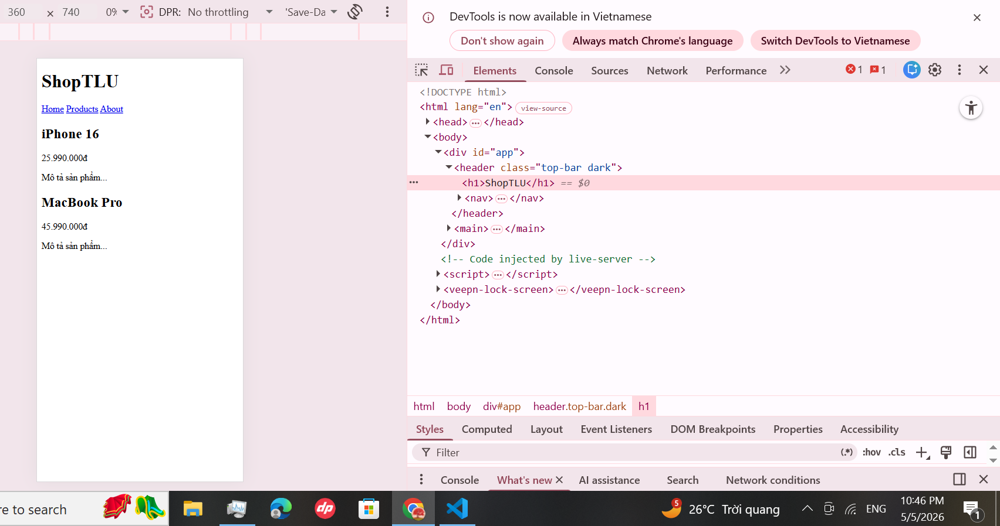
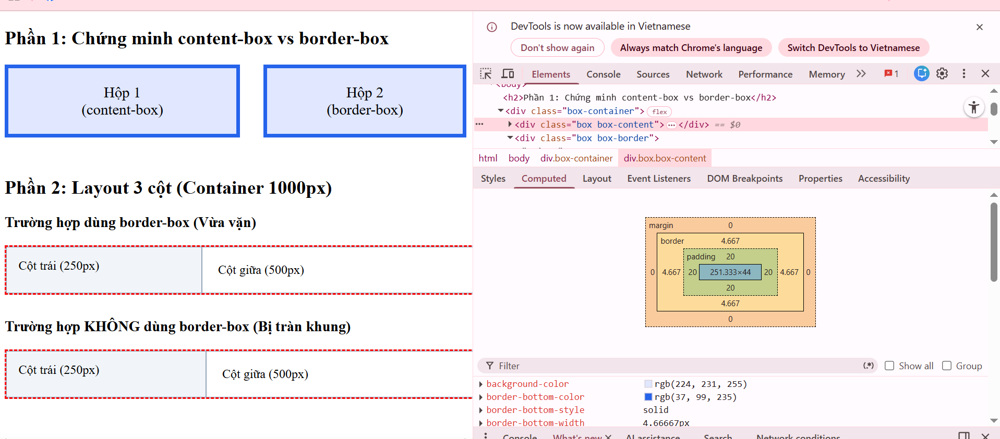
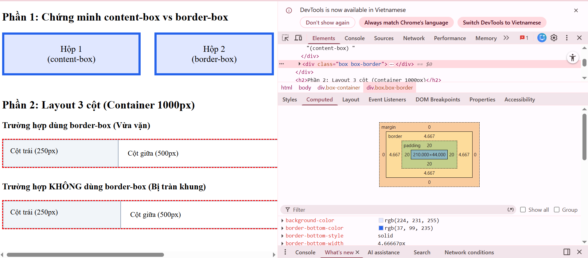

Phần A:
Câu A1: Nội dung lấy từ Chương 8
- 3 cách nhúng CSS vào HTML (inline, internal, external):
1. Inline CSS 
Ví dụ code: <h1 style="color: #2563eb; font-size: 32px;">cach 1</h1>.

+ Ưu điểm: Có thể áp dụng style nhanh chóng cho một phần tử cụ thể mà không cần viết thêm quy tắc chọn (selector).
+ Nhược điểm: Không thể tái sử dụng code, gây khó khăn cho việc bảo trì khi dự án lớn dần và làm code HTML trở nên rối.
--> Chỉ dùng cho các trường hợp xử lý khẩn cấp hoặc cần ghi đè (override) style tạm thời cho một phần tử duy nhất.

2. Internal CSS 
Ví dụ code:

HTML
<head>
    
</head>

+ Ưu điểm: Phù hợp cho các dự án nhỏ hoặc trang web đơn (single-page), dễ dàng kiểm soát style của toàn bộ trang trong một file HTML duy nhất.
+ Nhược điểm: Không thể tái sử dụng style cho các trang HTML khác trong cùng một website.
--> Dùng khi làm bản thảo hoặc cho những trang web chỉ có duy nhất một file HTML.

3. External CSS
Ví dụ code:

HTML
<head>
    <link rel="stylesheet" href="styles.css">
</head>

+ Ưu điểm: Tối ưu hiệu suất nhờ cơ chế lưu bộ nhớ đệm của trình duyệt, dễ dàng tái sử dụng cho hàng trăm trang web và giúp tách biệt hoàn toàn giữa nội dung (HTML) và giao diện (CSS).
+ Nhược điểm: Trình duyệt mất thêm thời gian để tải file CSS riêng biệt từ server về.
--> Đây là cách chuẩn để áp dụng cho mọi dự án thực tế và chuyên nghiệp.

Câu A2:
1. h1   --> chọn: ShopTLU                        
2. .price  --> chọn: 25.990.000đ và 45.990.000đ                   
3. #app header   --> chọn: ShopTLU Home Products About          
4. nav a:first-child      --> chọn: home      
5. .product.featured h2    --> chọn: MacBook Pro     
6. article > p       --> chọn: 25.990.000đ, Mô tả sản phẩm..., 45.990.000đ, Mô tả sản phẩm...           
7. a[href="/"]         --> chọn: Home         
8. .top-bar.dark h1     --> chọn: ShopTLU         
screenshot: 

Câu A3: Nội dung: chương 11
1. Trường hợp 1: content-box 
- Chiều rộng hiển thị thực tế:
400 (width) + 20 (padding trái) + 20 (padding phải) + 5 (border trái) + 5 (border phải) = 450px

- Không gian chiếm trên trang:
450 (chiều rộng thực tế) + 10 (margin trái) + 10 (margin phải) = 470px

2. Trường hợp 2: border-box
Trong mô hình border-box, thuộc tính width đã bao gồm cả content, padding và border. Đây là cách tính phổ biến giúp chúng ta kiểm soát kích thước chuẩn xác hơn.

- Chiều rộng hiển thị = 400px
- Kích thước content thực tế:
400 (tổng width) - 20 (padding trái) - 20 (padding phải) - 5 (border trái) - 5 (border phải) = 350px
- Không gian chiếm trên trang:
400 (chiều rộng thực tế) + 10 (margin trái) + 10 (margin phải) = 420px

3. Trường hợp 3: Margin collapse 
Khoảng cách giữa box-a và box-b: 40px
--> Trong CSS, khi hai lề dọc (top và bottom) của hai khối kề nhau, chúng không cộng dồn (25 + 40 = 65) mà sẽ xảy ra hiện tượng Margin Collapse. Trình duyệt sẽ so sánh và lấy giá trị lớn nhất giữa hai lề để áp dụng. Ở đây, 40px lớn hơn 25px nên khoảng cách là 40px.

Phần nâng cao: Margin âm
- Nếu .box-a có margin-bottom: -10px và .box-b có margin-top: 40px:
- Khoảng cách thực tế: 30px
--> Khi kết hợp giữa margin dương và margin âm, khoảng cách sẽ được tính bằng tổng đại số: 40px + (-10px) = 30px.

Câu A4:
1. Tính toán điểm Specificity (ID, Class, Element)
- Điểm số được tính theo cấu trúc: (Số lượng ID, Số lượng Class/Attribute, Số lượng Element).
+ Rule A (p): Điểm là (0, 0, 1). Vì chỉ có duy nhất 1 thẻ element.
+ Rule B (.price): Điểm là (0, 1, 0). Vì chỉ có duy nhất 1 class selector.
+ Rule C (#main-price): Điểm là (1, 0, 0). Vì có 1 ID selector (ID luôn có điểm rất cao).
+ Rule D (p.price): Điểm là (0, 1, 1). Vì bao gồm 1 class và 1 element selector cộng lại.

2. Xác định màu sắc hiển thị
Kết quả: Phần tử sẽ có màu Đỏ .
--> Trình duyệt thực hiện so sánh điểm Specificity từ trái qua phải (từ bậc ID đến bậc Element). Rule C có 1 điểm ở cột ID, trong khi tất cả các quy tắc còn lại đều bằng 0 ở cột này. Trong CSS, một ID Selector luôn có quyền ưu tiên cao hơn bất kỳ số lượng class hay thẻ element nào cộng lại. Do đó, màu của Rule C sẽ được áp dụng.

3. Trường hợp thêm Inline Style (style="color: orange;")
Kết quả: Phần tử sẽ chuyển sang màu Cam .
--> Theo quy tắc phân tầng (Cascade), Inline CSS (viết trực tiếp trong thẻ HTML) có độ ưu tiên cao hơn tất cả các bộ chọn trong file CSS bên ngoài (External) hoặc thẻ style (Internal), bao gồm cả bộ chọn ID.

4. Trường hợp Rule A thêm !important
Kết quả: Phần tử sẽ có màu Đen .
-->Từ khóa !important là một chỉ thị đặc biệt trong CSS dùng để phá vỡ mọi quy tắc ưu tiên thông thường. Khi p { color: black !important; } được khai báo, nó sẽ ghi đè lên cả ID selector và cả Inline style để áp dụng màu đen cho phần tử. Tuy nhiên, trong lập trình phần mềm, chúng mình nên hạn chế dùng cách này vì nó gây khó khăn cho việc bảo trì code sau này.

__________________________________________________________________________
Phần B:
Câu B1:
- 5 loại Selector đã sử dụng trong file style.css:
1. **Element Selector (Bộ chọn thẻ):** - VD: `body { ... }`, `header { ... }`, `table { ... }` 
2. **Class Selector (Bộ chọn lớp):** - VD: `.active { ... }` (nằm trong `nav a.active`)
3. **ID Selector (Bộ chọn định danh):** - VD: `#skills-table { ... }` 
4. **Descendant Selector (Bộ chọn con cháu):** - VD: `nav a { ... }`
5. **Pseudo-class Selector (Bộ chọn trạng thái / lớp giả):** - VD 1: `nav a:hover { ... }` và `tr:hover { ... }` (Bắt trạng thái rê chuột).

Câu B2:
- Hộp 1 (content-box): Chiều rộng thực tế = 300.667px

- Hộp 2 (border-box): Chiều rộng thực tế = 259.334px 

- Giải thích sự khác biệt:
Mặc dù cả 2 hộp đều bị Flexbox ép nhỏ lại do thiếu diện tích màn hình, nhưng sự khác biệt về Box Model vẫn rất rõ rệt:
+ Ở Hộp 1 (content-box): Thuộc tính width ưu tiên giữ không gian cho vùng nội dung (content) to nhất có thể (251.333px), sau đó mới cộng dồn padding và border ra bên ngoài.
+ Ở Hộp 2 (border-box): Trình duyệt ép padding và border vào *bên trong* tổng diện tích của hộp, khiến vùng nội dung (content) bắt buộc phải co hẹp lại chỉ còn 210px.

