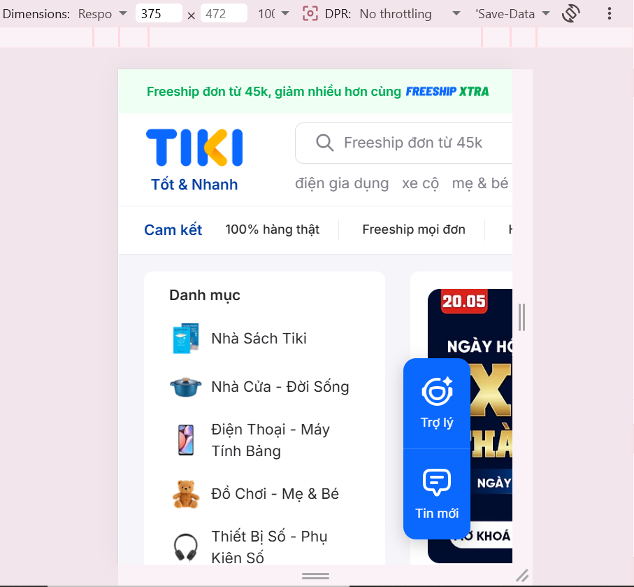
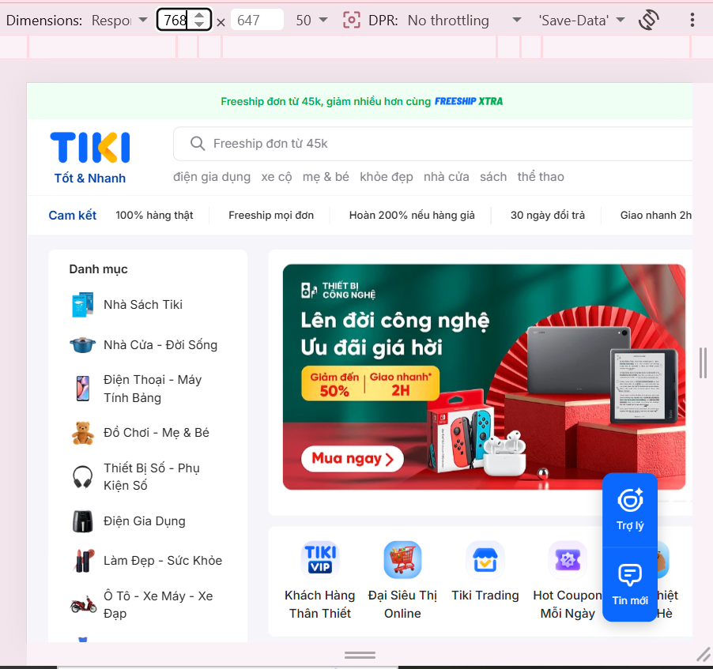
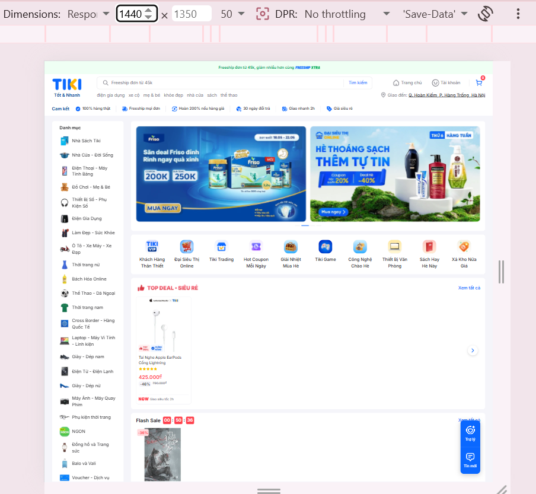
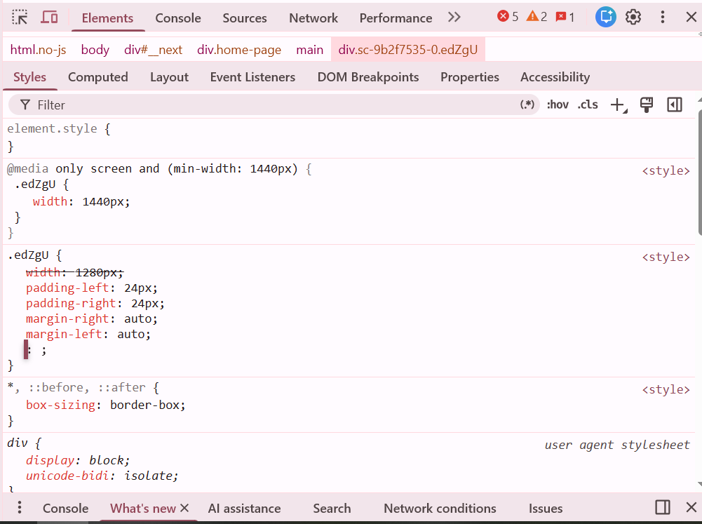

Câu A1: tham khảo nội dung chương 13
1. Thẻ <meta viewport> chuẩn và giải thích các thuộc tính
Thẻ chuẩn:
HTML
<meta name="viewport" content="width=device-width, initial-scale=1.0">
Giải thích từng thuộc tính:

name="viewport": Khai báo cho trình duyệt biết thẻ meta này dùng để điều khiển và cấu hình vùng nhìn (viewport) trên thiết bị.

width=device-width: Hướng dẫn trình duyệt thiết lập chiều rộng của trang web đúng bằng với chiều rộng vật lý của màn hình thiết bị đang hiển thị, giúp layout tự động khớp với mọi kích thước màn hình.

initial-scale=1.0: Đặt mức độ thu phóng ban đầu của trang web là 100% (không bị phóng to hay thu nhỏ) khi trang vừa được tải xong.

2. Nếu THIẾU thẻ <meta viewport>, iPhone sẽ hiển thị trang web như thế nào?
Nếu thiếu thẻ này, Safari trên iPhone (và các trình duyệt di động khác) sẽ mặc định coi đó là một trang web dành cho Desktop. Trình duyệt sẽ render trang ở một chiều rộng cố định (thông thường là 980px), sau đó tự động thu nhỏ (scale down) toàn bộ trang lại để nhét vừa vào chiều rộng hẹp của màn hình điện thoại.
Hậu quả là toàn bộ nội dung (chữ, hình ảnh, nút bấm) sẽ hiển thị cực kỳ nhỏ. Người dùng bắt buộc phải dùng thao tác vuốt phóng to (pinch-to-zoom) và cuộn ngang/dọc liên tục mới có thể đọc nội dung và tương tác.

3. Sự khác nhau giữa Mobile-First và Desktop-First, Ví dụ CSS, và Lý do khuyên dùng Mobile-First
Sự khác biệt cốt lõi:
Mobile-First (Ưu tiên thiết bị di động): Phương pháp tiếp cận "Tăng cường dần" (Progressive Enhancement). Viết CSS mặc định cho màn hình nhỏ nhất (điện thoại) trước. Sau đó dùng Media Queries với min-width để bổ sung, nâng cấp và mở rộng layout khi kích thước màn hình lớn lên (Tablet, Desktop).

Desktop-First (Ưu tiên máy tính): Phương pháp tiếp cận "Thoái hóa duyên dáng" (Graceful Degradation). Viết CSS mặc định cho màn hình lớn nhất (PC) trước. Sau đó dùng Media Queries với max-width để thu hẹp, ẩn bớt phần tử hoặc đơn giản hóa layout khi kích thước màn hình nhỏ đi.

Ví dụ CSS với breakpoint 768px:
Ví dụ Mobile-First:
CSS
/* CSS mặc định được viết cho Mobile (dưới 768px) */
.layout {
    display: block;
    width: 100%;
}
.sidebar {
    display: none; /* Ẩn sidebar trên điện thoại */
}

/* Áp dụng thêm từ màn hình Tablet trở lên (>= 768px) */
@media (min-width: 768px) {
    .layout {
        display: flex;
    }
    .sidebar {
        display: block; /* Hiện sidebar trên màn hình lớn */
        width: 250px;
    }
}

Ví dụ Desktop-First:
CSS
/* CSS mặc định được viết cho Desktop (từ 768px trở lên) */
.layout {
    display: flex;
}
.sidebar {
    display: block;
    width: 250px;
}

/* Ghi đè CSS để thu gọn cho màn hình Mobile (dưới 768px) */
@media (max-width: 767.98px) {
    .layout {
        display: block;
        width: 100%;
    }
    .sidebar {
        display: none; /* Ẩn sidebar trên điện thoại */
    }
}
- Mobile-First được khuyên dùng vì
+ Tối ưu hiệu suất (Performance) cho thiết bị di động: Thiết bị di động thường có cấu hình phần cứng yếu hơn và tốc độ mạng chậm hơn PC. Với Mobile-First, trình duyệt trên điện thoại chỉ cần tải và biên dịch đoạn CSS mặc định rất nhẹ, bỏ qua các đoạn code phức tạp nằm trong Media Queries của màn hình lớn. Ngược lại, nếu dùng Desktop-First, điện thoại sẽ phải tải toàn bộ CSS nặng nề của Desktop rồi mới chạy thêm lệnh để giấu đi, gây lãng phí tài nguyên.

+ Tập trung vào Trải nghiệm người dùng (UX) cốt lõi: Thiết kế trên một không gian nhỏ hẹp bắt buộc lập trình viên phải chắt lọc, ưu tiên giữ lại các tính năng và nội dung quan trọng nhất. Từ cái lõi tinh gọn này mở rộng lên màn hình lớn sẽ dễ dàng và hợp lý hơn so với việc lấy một layout khổng lồ của Desktop rồi tìm cách nhồi nhét, cắt xén để ép vào màn hình điện thoại.
__________________________________________________________________________________________
Câu A2:
1. Extra small (xs)
Kích thước pixel: < 576px
Thiết bị đại diện: Điện thoại di động cầm dọc (Smartphones).
Ví dụ lưới sản phẩm: Hiển thị 1 cột.

2. Small (sm)
Kích thước pixel: ≥ 576px
Thiết bị đại diện: Điện thoại di động cầm ngang (Landscape phones).
Ví dụ lưới sản phẩm: Hiển thị 2 cột.

3. Medium (md)
Kích thước pixel: ≥ 768px
Thiết bị đại diện: Máy tính bảng (Tablets).
Ví dụ lưới sản phẩm: Hiển thị 3 cột.

4. Large (lg)
Kích thước pixel: ≥ 992px
Thiết bị đại diện: Máy tính xách tay, máy tính để bàn cỡ nhỏ (Laptops / Small Desktops).
Ví dụ lưới sản phẩm: Hiển thị 4 cột.

5. Extra large (xl) và Extra extra large (xxl)
Kích thước pixel: ≥ 1200px (xl) và ≥ 1400px (xxl)
Thiết bị đại diện: Máy tính để bàn màn hình lớn (Large Desktops).
Ví dụ lưới sản phẩm: Hiển thị 5 đến 6 cột.

Câu A3:
Chiều rộng màn hình.container width
375px (iPhone SE)   100%
600px               540px
800px               720px
1000px              960px
1400px              1140px

Câu A4: nội dung: chương 16
- Variables (Biến):
--> Giải thích: Cho phép lưu trữ các giá trị thường xuyên sử dụng lại (như mã màu, font chữ, kích thước) vào một biến có tiền tố $. Khi cần thay đổi, chỉ cần đổi giá trị ở biến thì toàn bộ file sẽ cập nhật theo, giúp bảo trì code dễ dàng.

Ví dụ:

SCSS
$primary-color: #3498db;
$base-font: 'Arial', sans-serif;

body {
    color: $primary-color;
    font-family: $base-font;
}
Nesting (CSS lồng nhau):

Giải thích: SCSS cho phép viết các CSS selector lồng vào nhau theo đúng cấu trúc phân cấp bậc của HTML. Giúp mã nguồn gọn gàng, trực quan và hạn chế việc lặp lại tên class cha nhiều lần. Ký tự & được dùng để đại diện cho phần tử cha (thường dùng cho hover, active, pseudo-classes).

Ví dụ:

SCSS
nav {
    background-color: #333;
    ul {
        list-style: none;
    }
    a {
        color: white;
        &:hover {
            color: red;
        }
    }
}
Mixins (@mixin, @include):

Giải thích: Cho phép đóng gói một nhóm các thuộc tính CSS lại thành một module có thể tái sử dụng ở nhiều nơi. Điểm mạnh của Mixins so với @extend là nó có thể nhận tham số (arguments) truyền vào giống như hàm trong lập trình.

Ví dụ:

SCSS
@mixin flex-center {
    display: flex;
    justify-content: center;
    align-items: center;
}

.container {
    @include flex-center;
    width: 100%;
}
@extend / Inheritance (Kế thừa):

Giải thích: Cho phép một selector chia sẻ (kế thừa) toàn bộ các thuộc tính CSS của một selector khác. Giúp tuân thủ nguyên tắc DRY (Don't Repeat Yourself), giảm thiểu code lặp lại.

Ví dụ:

SCSS
.btn-base {
    padding: 10px 20px;
    border: none;
    border-radius: 5px;
}

.btn-submit {
    @extend .btn-base; /* Kế thừa padding, border, border-radius */
    background-color: green;
}

2.
- Lý do trình duyệt không đọc được: Trình duyệt web (Chrome, Safari, Firefox...) được thiết kế chỉ để hiểu và phân tích cú pháp ngôn ngữ CSS tiêu chuẩn. Phân mở rộng .scss (Sassy CSS) chứa các cú pháp lập trình nâng cao (như khai báo biến $, @mixin, lồng nhau) vốn không tồn tại trong đặc tả chuẩn của ngôn ngữ CSS, do đó trình duyệt không thể dịch được.

- Bước cần thực hiện: Phải thực hiện bước Biên dịch (Compilation). File .scss bắt buộc phải được chạy qua một trình biên dịch (như Node-sass, Dart Sass, hoặc các extension như Live Sass Compiler trên VS Code) để dịch toàn bộ cú pháp SCSS thành một file .css tiêu chuẩn. Cuối cùng, thẻ <link> trong file HTML sẽ gọi đến file .css đã được biên dịch này chứ không gọi file .scss.

________________________________________________________________
Câu B3:
- Lệnh Compile SCSS sang CSS:
# Lệnh biên dịch chuẩn bằng Dart Sass (Biên dịch thư mục scss sang thư mục css)
sass scss/style.scss css/style.css

# Hoặc lệnh theo dõi tự động biên dịch khi có thay đổi (Watch mode)
sass --watch scss/style.scss css/style.css

________________________________________________________________
Phần C:
Câu C1:
Màn hình Mobile (375px)

Navigation: Hệ thống điều hướng thay đổi hoàn toàn. Thanh Header trên cùng (Top Bar) bị lược bỏ các liên kết phụ, chỉ giữ lại thanh tìm kiếm (Search bar) và icon Giỏ hàng. Xuất hiện thêm thanh điều hướng cố định ở dưới đáy màn hình (Bottom Navigation Bar) chứa các mục: Home, Mall, Live, Thông báo, Tôi.

Lưới content: Lưới sản phẩm (Gợi ý hôm nay) thu gọn lại thành 2 cột. Các danh mục sản phẩm chuyển thành dạng cuộn ngang (horizontal scroll).

Elements bị ẩn: Các liên kết phụ trên Header (Kênh Người Bán, Tải ứng dụng, Kết nối, Hỗ trợ), Banner quảng cáo kích thước lớn hai bên, và phần Footer chi tiết bị ẩn đi hoặc rút gọn thành các accordion (menu thả xuống).

Font size: Font chữ được thu nhỏ lại (khoảng 12px - 14px) để hiển thị được nhiều thông tin hơn trên không gian hẹp.

Màn hình Tablet (768px)

Navigation: Thanh tìm kiếm được kéo dài ra. Thanh Bottom Navigation (của Mobile) biến mất.

Lưới content: Lưới sản phẩm mở rộng lên thành 4 cột.

Elements bị ẩn: Một số liên kết trên Top Bar vẫn bị ẩn so với bản Desktop để tránh lộn xộn. Filter (bộ lọc) ở các trang tìm kiếm thường bị ẩn vào trong một nút bấm (nhấn vào mới hiện ra popup).

Font size: Tăng nhẹ so với Mobile, các khoảng trắng (padding/margin) giữa các phần tử cũng được nới lỏng ra để dễ thao tác chạm (touch).

Màn hình Desktop (1440px)

Navigation: Hiển thị Header đầy đủ nhất. Có thanh Top Bar chứa toàn bộ liên kết (Kênh Người Bán, Trở thành Người bán Shopee, Tải ứng dụng, Đăng ký, Đăng nhập). Dưới thanh tìm kiếm xuất hiện các từ khóa gợi ý phổ biến (trending tags).

Lưới content: Lưới sản phẩm (Gợi ý hôm nay) hiển thị tối đa 6 cột. Banner quảng cáo (Carousel) hiển thị kích thước lớn nhất.

Elements bị ẩn: Thanh Bottom Navigation không tồn tại. Nút cuộn ngang của danh mục biến mất vì toàn bộ danh mục đã hiển thị đủ trên lưới.

Font size: Kích thước font chữ tiêu chuẩn (thường base ở 14px - 16px), dễ đọc với khoảng cách nhìn từ mắt đến màn hình máy tính.

2. Phân tích Media Queries qua DevTools
 chụp ảnh các rule @media

Dưới đây là 2 quy tắc @media tiêu biểu được sử dụng để điều khiển layout:

Quy tắc 1: Thiết lập kích thước tối đa cho Container trên Desktop

CSS
@media (min-width: 1200px) {
    .container {
        width: 1200px;
    }
}
Phân tích: Khi màn hình có chiều rộng từ 1200px trở lên, khối .container bọc toàn bộ nội dung trang web sẽ bị khóa cứng ở mức 1200px và được căn giữa. Điều này ngăn trang web bị giãn ra vô tận trên các màn hình quá lớn (như màn 27 inch hoặc ultrawide), giữ cho bố cục lưới 6 cột luôn hiển thị đúng tỷ lệ.

Quy tắc 2: Điều chỉnh lưới sản phẩm cho màn hình nhỏ

CSS
@media (max-width: 768px) {
    .col-xs-2-4 {
        width: 50%; /* Tương đương 2 cột */
    }
    .footer-section {
        display: none;
    }
}
Phân tích: Khi thiết bị có chiều rộng nhỏ hơn hoặc bằng 768px (Tablet dọc hoặc Mobile), class cột của sản phẩm bị ép về 50% chiều rộng (tạo thành lưới 2 cột). Đồng thời, một số phần của Footer chi tiết (các cột thông tin dài dòng) sẽ bị áp dụng display: none; để giấu đi, giúp người dùng cuộn trang trên điện thoại nhanh hơn mà không bị vướng.

Câu C2:
1. Sơ đồ bố cục (Wireframe Strategy)
- Mobile (< 768px):
+ Những gì bị ẩn? Chữ "Gọi điện đặt bàn" (chỉ giữ icon gọi), mô tả chi tiết trên ảnh món ăn (nếu có).
+ Form nằm đâu? Nằm ngay dưới lưới ảnh món ăn, trải rộng 100% chiều rộng (1 cột).

- Tablet (768px - 1023px):
+ Grid ảnh 3 cột.
+ Bản đồ nằm nằm ngang hàng với Form đặt bàn (chia lưới 2 cột: Form bên trái, Bản đồ bên phải).

- Desktop (≥ 1024px):
+ Layout  2 cột chính (Cột nội dung chính và Sidebar).
+ Sidebar Có. Form đặt bàn sẽ được đặt vào Sidebar bên phải và thiết lập dính (sticky) khi cuộn trang. Cột trái chứa Hero image, Grid ảnh và Bản đồ.

CSS skeleton trong file skeleton.css